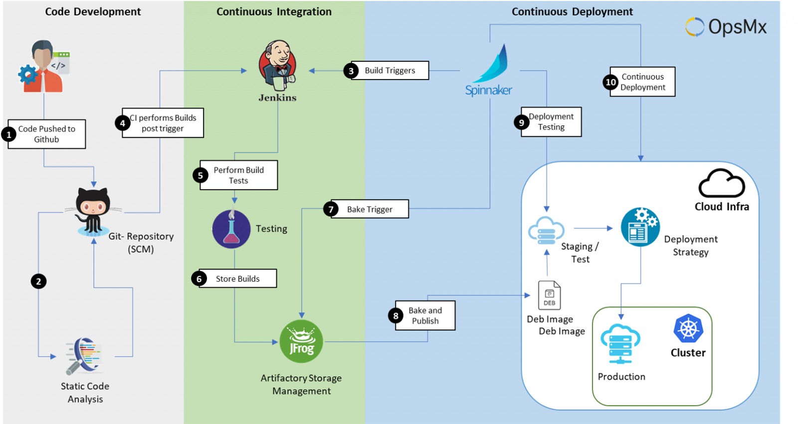

# CICD

What is CICD?
- CI:
  - Continuous Integration
  - Developers frequently merge code changes into a shared repository.
  - Automated builds and tests run to detect errors early.
  - Helps ensure that new code integrates well with the existing system.
- CD:
  - Continuous Deployment/Delivery.
  - After CI, the code is automatically prepared for release, but deployment requires manual approval.
-  software development practice that automates the process of integrating code changes, testing, and deploying applications.

Benefits:
- Faster development cycles.
- Reduced bugs and errors in production.
- Automated and reliable software releases.
- Improved collaboration among development teams.

# Jenkins

## What is Jenkins? 
- An open-source automation server used for Continuous Integration (CI) and Continuous Deployment (CD). 
- It helps automate software development processes like building, testing, and deploying applications.

## Benefits:
- Faster software deployment.
- Improved software quality (automated testing and code stability).
- Scalable and flexible.
- Large plugin ecosystem- integrates largely. 
- CD- reduces human intervention.
- Seemless integration with DevOps tools.
  
## How Jenkins Works:

1. Developers commit code → Push changes to a version control system (e.g., GitHub, GitLab).
2. Jenkins detects changes → Automatically triggers a build.
3. Build & Test → Jenkins compiles the code and runs automated tests.
4. Deploy → If tests pass, Jenkins deploys the application (e.g., to a staging or production server).

Alternatives to jenkins= 
- GitHub Actions
- GitLab CI/CD
- CircleCI
- Travis CI

## Business value:
Building a CI/CD pipeline isn't just a technical upgrade—it’s a business enabler. It helps organizations:

-  Deliver faster & better software
-  Reduce costs & risks#
-  Increase customer satisfaction & revenue.

# CICD Pipeline:
### CI
1. Trigger (e.g. git push) (dev branch).
2. Test 
3. Merge (into the main branch).
### CD
1. Deploy (depends on the architecture)- vm, container etc.
2. Trigger- git push- needs a webhook to be set up. Jenkins needs to listen for a notification for a change made to the code on github.

**Webhook** = something that needs to inform something else something that happens. 
- One service sends notif, one service is listening for the notif.

## Why build a pipeline:
- Making devs life easier.
- Quickly get changes to end users.
- Reduce risk of big code changes messing things up. 
- Business value - Save time, save money, users are actually using the latest code/features quickly.